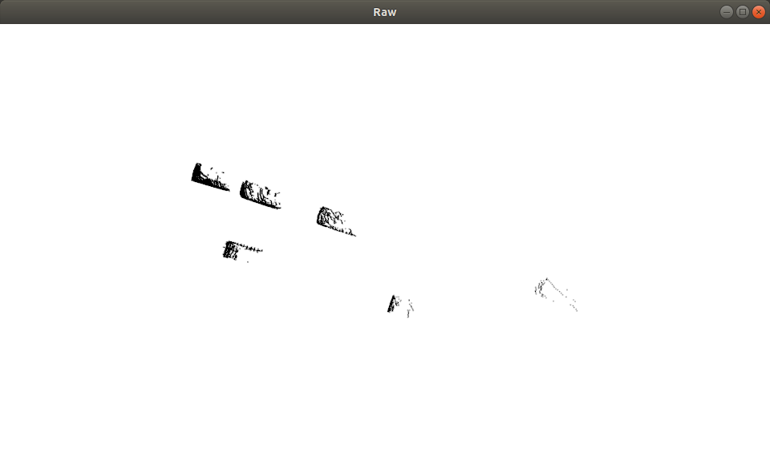
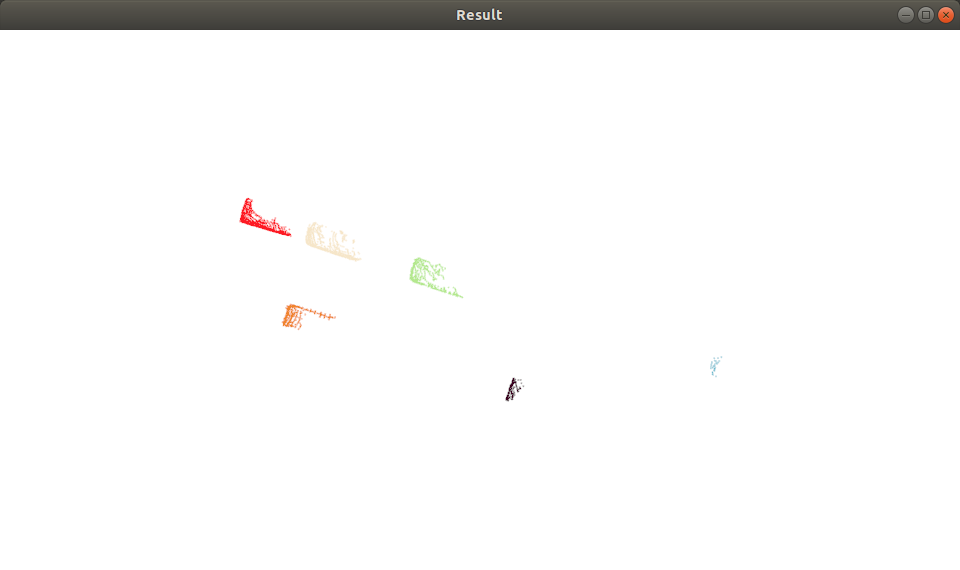

# DBSCAN for point cloud segmentation

## About

Use DBSCAN algorithm to segment point cloud cluster. Use Kd-tree for radius search. 
Also as the final project for Data Minig Course(AU7008 SJTU). 

## Dependencies

The code was tested under:

* Ubuntu18.04
* PCL 1.8
* CMake 3.17.5

## Usage

set your PCL dir in CMakeLists.txt(Line:5)
then
``` bash
mkdir build
cd build
cmake ..
make
./DBSCAN_point_cloud_node  # ./DBSCAN_point_cloud_node ${Data_dir} if you want to use your own data.
```


## Result

data: kitti/000008.bin
change .bin to .pcd and each obstacle has been extracted in advance.

### teminal output

```
-------------- info --------------
Min Points:     20
Epsilon:        0.5
File Name:      ../data/kitti/000008.pcd
Raw Points Size:        10669
-------------- test --------------
Use Voxel, voxel leaf size:     0.1
point size(after voxelized):    2897
cluster num:    6
noise point num:        0
Extract by Time:        72.0748 ms.
```

### visualization

Raw Point Cloud:

Result:

